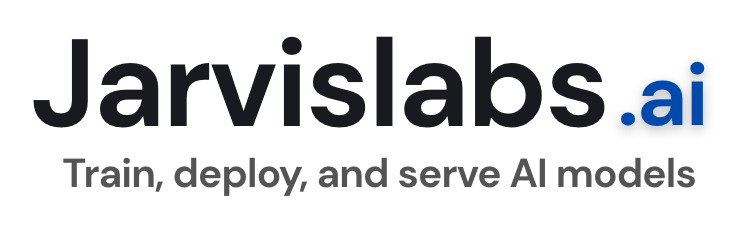

<p align="center">
  
</p>

<h1 align="center">Meets</h1>

<p align="center">
<a href="https://trendshift.io/repositories/25442?utm_source=repository-badge&amp;utm_medium=badge&amp;utm_campaign=badge-repository-25442" target="_blank" rel="noopener noreferrer"></a>
</p>

<p align="center">
  <strong>Local-by-default meeting transcription for macOS</strong><br>
  On-device speech-to-text by default · Optional AI meeting notes · Privacy by default
</p>

<p align="center">
  <a href="LICENSE"></a>
  <a href="https://buymeacoffee.com/phequals7"></a>
  
  
</p>

---

## What is Meets?

Meets is a **lightweight native macOS app for meeting recording, transcription, and notes** — a meetings-only fork of Muesli. Meeting transcription runs locally on Apple Silicon by default: your mic and system audio are captured and converted to a timestamped transcript on your Mac. Audio leaves your device only when you explicitly select an optional AI notes backend such as ChatGPT, OpenAI, OpenRouter, Ollama, LM Studio, or a custom LLM to receive the meeting text you choose to send. iCloud sync transfers text and sync metadata, never audio.

<p align="center">
  
</p>

<p align="center"><sub>Illustrative entries and usage statistics. Personal content has been replaced.</sub></p>

### New in 0.8.4

| Feature | What you can do |
|---|---|
| **Bodhan for Indic languages** | Transcribe across Indic languages and English, including code-switching. |
| **Live meeting transcripts** | Use Apple Speech on macOS 26+. Live transcription is off by default. |
| **Re-summarize meetings** | Choose a different summary model for a saved meeting. |

This release also adds S1-mini English cleanup, Apple Shortcuts and Siri actions, clearer macOS calendar management, and iCloud reconnection recovery. [Read the full 0.8.4 release notes](docs/release-notes/0.8.4.md).

### Meeting Transcription
Start a meeting recording → Meets captures your mic (You) and system audio (Others) simultaneously → VAD-driven chunked transcription happens during the meeting at natural speech boundaries → speaker diarization identifies individual remote speakers (Speaker 1, Speaker 2, etc.) → when you stop, the transcript is ready in seconds, not minutes. Generate structured meeting notes via ChatGPT, OpenAI, free OpenRouter models, or local Ollama, LM Studio, and Custom LLM endpoints.

Live meeting transcripts have two explicit modes. **Nemotron 3.5** and **Apple Speech** supply live captions and the normal final raw transcript before diarization and note generation. The existing recorded-audio transcription pipeline remains available for missing or incomplete streaming results. **Parakeet Realtime EOU** provides provisional live previews while a separately selected meeting model creates the final transcript. Apple Speech adds system-supported languages on macOS 26+, while Parakeet Realtime EOU remains the low-latency English option. Settings always shows which model owns the final transcript.

Live transcription is off by default. Choose Apple Speech, or download Parakeet Realtime EOU or Nemotron 3.5, from Models and then select one under **Settings → Meetings → Transcription**. The waveform-hover preview can be enabled separately from the same section. Making a live model available does not activate it automatically.

---

## Features

- **Native macOS architecture** — Swift, AppKit, and SwiftUI app code with in-process CoreML/ANE, Metal, and LiteRT-LM inference.
- **Multiple ASR providers for meetings** — Apple Speech (system-managed on macOS 26+), Parakeet TDT and Nemotron 3.5 (Neural Engine), Cohere Transcribe 2B (mixed precision CoreML), multilingual Whisper Tiny/Small/Large Turbo (CoreML/ANE via WhisperKit), Qwen3 ASR, SenseVoice Small, Bodhan Core/Flex for Indic and English speech, and experimental Gemma 4 E2B.
- **Apple Shortcuts & Siri** — Three preconfigured actions out of the box: Start Meeting Recording, Stop Meeting Recording, and Get Last Meeting Notes. Trigger them from Spotlight, Siri ("Start a meeting recording in Meets"), keyboard shortcuts, or Shortcuts automations — e.g. auto-record when a calendar event starts, or pipe your last meeting notes into Notes, Messages, or Files.
- **Meeting recording** — Captures mic + system audio (including Bluetooth/AirPods) with a CoreAudio process tap by default and ScreenCaptureKit fallback. System audio from Zoom, Teams, and other call clients stays on the Others side of the transcript.
- **Live meeting transcript** — Choose Nemotron 3.5 or system-managed Apple Speech (macOS 26+) for multilingual live-and-final transcripts, or Parakeet Realtime EOU for an English live preview paired with a separate final meeting model.
- **VAD-driven chunk rotation** — Silero VAD detects natural speech boundaries in real-time, splitting mic audio at pauses instead of fixed intervals. No mid-sentence cuts.
- **Speaker diarization** — Identifies individual speakers in system audio (Speaker 1, Speaker 2, etc.) using FluidAudio's pyannote-based CoreML diarization model.
- **Camera-based meeting detection** — Detects when your webcam + mic activate in a recognized meeting app (Zoom, Chrome, Teams, FaceTime, Slack, WhatsApp). Camera alone (e.g. Photo Booth) won't trigger false positives.
- **Join & Transcribe** — Extracts meeting URLs from calendar events (Zoom, Google Meet, Teams, Webex, Chime, FaceTime). Split-button notification: "Join & Transcribe" opens the meeting + starts transcription, "Join Only" opens without transcribing, "Transcribe Only" starts transcription without joining. Platform icons (Zoom, Meet) in the notification panel.
- **macOS Calendar integration** — See upcoming meetings from calendars connected to your Mac, including iCloud, Google, and Exchange, in the Coming Up section and status bar. Choose whether Meets watches today, two days, or three days of upcoming events. Event-driven notifications via `EKEventStoreChangedNotification` for instant calendar change detection. Pre-meeting countdowns via Marauder's Map easter egg.
- **Import Audio** — Import m4a, mp4, wav, or mp3 files for offline transcription, speaker diarization, title generation, summaries, and saved meeting history.
- **Meeting export** — Export meeting notes or transcripts as PDF (paginated US Letter) or Markdown. Format picker in the save panel, auto-opens the exported file.
- **Meeting templates** — Built-in and custom templates for meeting notes. Choose a template before or after recording — re-summarize any meeting with a different template.
- **Dismiss calendar events** — Hide irrelevant events from Coming Up, status bar, and menu bar. Dismissed events are pruned automatically.
- **iCloud Text Sync & iPhone Bridge** — Privately sync meeting transcripts, notes, summaries, and manual notes with Meets for iPhone through iCloud. Audio recordings are never synced.
- **Optional transcript cleanup** — Refine transcribed text locally with **[S1-mini by Superwhisper](https://huggingface.co/superwhisper/s1-mini-GGUF)**, Meets's GGUF cleanup models, or on-device Gemma 4 E2B; hosted providers are also available when preferred. S1-mini is for English transcription. Missing local cleanup models prompt a download and open **Models → Cleanup**.
- **Meeting context** — Optionally capture window/screen context (on-device OCR) during a meeting so your AI notes understand what was on screen; requires Accessibility permission.
- **Filler word removal** — Automatically strips "uh", "um", "er", "hmm" and verbal disfluencies.
- **AI meeting notes** — Sign in with your ChatGPT Plus/Pro subscription (no API key needed), BYOK with OpenAI or OpenRouter, or use local Ollama, LM Studio, and Custom LLM endpoints. Auto-generated meeting titles. Re-summarize any saved meeting with a different summary model.
- **ChatGPT OAuth** — Sign in with your existing ChatGPT subscription via browser-based OAuth (PKCE). Tokens stored in the app support directory with owner-only file permissions.
- **Post-meeting hooks** — Run a user-supplied executable after completed meetings. Hooks receive a JSON payload on stdin and log results in the app support directory.
- **Personal dictionary** — Add custom words, phrase matches, and replacement pairs. Jaro-Winkler fuzzy matching auto-corrects transcription output.
- **Model management** — Download, delete, and switch between models from the Models tab. Background downloads that don't block the app.
- **Configurable meeting hotkey** — Record meetings with a global hotkey (e.g. ⌘⇧R), or any modifier/key combination you choose.
- **Onboarding** — First-launch wizard with model selection, real OS permission verification, and optional summary setup for ChatGPT, OpenAI, OpenRouter, or Ollama. Progress saved on every step — survives crashes and manual quits.
- **Launch at Login** — Start Meets automatically with macOS login items, with approval-state refresh in Settings.
- **Dark & light mode** — Adaptive theme with toggle in sidebar.
- **SwiftUI dashboard** — Meeting history, meeting notes (Notes-style split view), Insights (meeting analytics), meeting folders, dictionary, models, shortcuts, settings, about page.
- **Floating indicator** — Frosted glass pill with dynamic waveform, accent color customization, and click-to-stop for meetings.

---

## Install

### Download (recommended)

Download the latest `.dmg` from [Releases](https://github.com/Muesli-HQ/muesli/releases), open it, and drag Meets to Applications — or double-click to install automatically.

### Homebrew

```bash
brew install --cask muesli
```

Current Homebrew also resolves `brew install muesli` to the official cask; the
`--cask` form is shown to make the app install explicit.

### Build from source

**Build requirements:** Xcode 26.6 (Swift 6.3) on a compatible macOS 26 build host. The app deployment target remains macOS 14.2.

```bash
# Clone
git clone https://github.com/Muesli-HQ/muesli.git
cd muesli

# Build the bundled echo-cancellation runtime once
./scripts/build_localvqe.sh

# Build and install to /Applications
./scripts/build_native_app.sh

# Contributor dev build without the maintainer Developer ID certificate
MUESLI_SKIP_SIGN=1 ./scripts/dev-test.sh
```

Release builds are signed by the maintainer Developer ID certificate. External
contributors can use the unsigned dev build for local testing; it installs
`MeetsDev.app` with a separate bundle ID and app data directory.
See [CONTRIBUTING.md](CONTRIBUTING.md) for the full local development workflow.

The selected transcription model downloads on demand (~565 MB for the default English Parakeet Unified; ~450 MB for multilingual Parakeet v3).
The app bundle also includes the arm64 LiteRT-LM runtime (~61 MB) for experimental
Gemma 4 support; its ~2.6 GB model weights download only when Gemma is selected.

---

## Agent CLI

Meets bundles an agent-friendly local CLI (`meets-cli`) inside the app bundle:

- Installed path: `/Applications/Meets.app/Contents/MacOS/meets-cli`
- Dev path: `native/MeetsNative/.build/arm64-apple-macosx/debug/meets-cli`
- Future Homebrew alias: `muesli` once the official cask exposes the bundled binary as a command

The CLI is designed for coding agents such as Codex and Claude Code. It exposes meetings, raw transcripts, stored notes, and local audio-file transcription. Existing data commands return stable JSON so an agent can analyze them with its own model and write notes back without requiring a user-supplied OpenAI or OpenRouter key. `transcribe` prints plain transcript text by default so it works naturally in shell pipelines.

### What agents should do

1. Discover the CLI:
   ```bash
   command -v meets-cli || echo "/Applications/Meets.app/Contents/MacOS/meets-cli"
   ```
2. Inspect the command contract:
   ```bash
   /Applications/Meets.app/Contents/MacOS/meets-cli spec
   ```
3. Transcribe a local audio file:
   ```bash
   /Applications/Meets.app/Contents/MacOS/meets-cli transcribe file.mp3
   ```
   Homebrew users should eventually be able to use:
   ```bash
   muesli transcribe file.mp3
   ```
4. List recent meetings:
   ```bash
   /Applications/Meets.app/Contents/MacOS/meets-cli meetings list --limit 10
   ```
5. Fetch a full record:
   ```bash
   /Applications/Meets.app/Contents/MacOS/meets-cli meetings get 125
   ```
6. Summarize or analyze locally in the agent.
7. Write improved meeting notes back:
   ```bash
   cat notes.md | /Applications/Meets.app/Contents/MacOS/meets-cli meetings update-notes 125 --stdin
   ```

### Commands

- `meets-cli spec`
- `meets-cli info`
- `meets-cli transcribe <file> [--format text|json|markdown] [--model parakeet-v3|parakeet-v2|parakeet-eou-320ms|sensevoice|qwen3-asr|nemotron35|whisper-tiny|whisper-tiny-english|whisper-small|whisper-small-english|whisper-medium-english|whisper-large-turbo] [--dictionary PATH] [--summarize] [--save-meeting] [--title TITLE] [--output PATH]`
- `meets-cli meetings list [--limit N] [--folder-id ID]`
- `meets-cli meetings get <id>`
- `meets-cli meetings update-notes <id> (--stdin | --file <path>)`

### Audio transcription

Supported input files: `.mp3`, `.mp4`, `.m4a`, and `.wav`.

Default output is transcript text only:

```bash
meets-cli transcribe interview.mp3
```

Agent-friendly JSON output uses the normal CLI envelope:

```bash
meets-cli transcribe interview.m4a --format json
```

```json
{
  "ok": true,
  "command": "meets-cli transcribe",
  "data": {
    "transcript": "Raw transcript text...",
    "summary": null,
    "durationSeconds": 123.4,
    "wordCount": 420,
    "model": "parakeet-v3",
    "warnings": [],
    "savedMeetingID": null,
    "title": "interview"
  },
  "meta": {
    "schemaVersion": 1,
    "generatedAt": "2026-07-08T00:00:00Z",
    "dbPath": "/Users/example/Library/Application Support/Meets/muesli.db",
    "warnings": []
  }
}
```

Generate markdown notes with the configured API/local summary backend when available:

```bash
meets-cli transcribe interview.mp4 --summarize --format markdown --output notes.md
```

`--summarize` uses configured ChatGPT, OpenAI, OpenRouter, Ollama, LM Studio, or Custom LLM settings. If the configured backend is unavailable in headless CLI mode, Meets keeps the transcript and reports a warning instead of discarding the transcription.

Save the import into Meets as `source = audio_import`:

```bash
meets-cli transcribe interview.wav --save-meeting --title "Customer Interview"
```

### Dictionary import and export

The app's **Dictionary** tab supports importing and exporting the personal dictionary as JSON. Import merges entries by match word, updates an existing match when the imported definition differs, and appends new words. Export produces the same portable format accepted by `meets-cli --dictionary`:

```json
[
  {
    "word": "museli",
    "replacement": "muesli",
    "matching_threshold": 0.85
  }
]
```

The CLI also accepts an app `config.json` directly when it contains a `custom_words` array:

```bash
meets-cli transcribe interview.wav --dictionary ~/Library/Application\ Support/Meets/config.json
```

`parakeet-eou-320ms` is available for batch file transcription. The CLI chunks the audio internally and returns the completed transcript; it does not expose streaming partials for file transcription.

Direct app-bundle fallback path:

```bash
/Applications/Meets.app/Contents/MacOS/meets-cli transcribe file.mp3
```

### JSON contract

Data commands return JSON on stdout. `transcribe` returns plain text by default; pass `--format json` to use the envelope below.

Success shape:

```json
{
  "ok": true,
  "command": "meets-cli meetings get",
  "data": {},
  "meta": {
    "schemaVersion": 1,
    "generatedAt": "2026-03-17T00:00:00Z",
    "dbPath": "/Users/example/Library/Application Support/Meets/muesli.db",
    "warnings": []
  }
}
```

Failure shape:

```json
{
  "ok": false,
  "command": "meets-cli meetings get 999",
  "error": {
    "code": "not_found",
    "message": "No meeting exists with id 999.",
    "fix": "Run `meets-cli meetings list` to find a valid ID."
  },
  "meta": {
    "schemaVersion": 1,
    "generatedAt": "2026-03-17T00:00:00Z",
    "dbPath": "",
    "warnings": []
  }
}
```

Important meeting fields:

- `rawTranscript`
- `formattedNotes`
- `notesState`
- `calendarEventID`
- `micAudioPath`
- `systemAudioPath`

`notesState` values:

- `missing`
- `raw_transcript_fallback`
- `structured_notes`

### Notes for agent authors

- The CLI is JSON-first and intended to be machine-consumed.
- `transcribe` is text-first by default; use `--format json` for structured agent workflows.
- `formattedNotes` is the only write-back surface in v1.
- `rawTranscript` is read-only and should be treated as source material.
- If `notesState` is `missing` or `raw_transcript_fallback`, agents should prefer summarizing from `rawTranscript`.
- Use `--db-path` or `--support-dir` only when the default Meets data location is wrong.
- Read the [SQLite database guide](database-schema.md) before adding tables,
  columns, migrations, direct queries, or new sync fields.

---

## Models

| Model | Backend | Runtime | Size | Languages | Latency |
|-------|---------|---------|------|-----------|---------|
| **Apple Speech** | SpeechAnalyzer / SpeechTranscriber | System-managed | No Meets model download | System-supported locales | Live + final meetings on macOS 26+ |
| **Parakeet Unified** (default for English) | FluidAudio | CoreML / Neural Engine | ~565 MB | English | Offline batch |
| **Parakeet v3** (multilingual) | FluidAudio | CoreML / Neural Engine | ~450 MB | 25 languages | ~0.13s |
| Parakeet v2 | FluidAudio | CoreML / Neural Engine | ~450 MB | English only | ~0.13s |
| Parakeet Realtime EOU | FluidAudio | CoreML / Neural Engine | ~430 MB | English only | Live preview |
| **Cohere Transcribe 2B** | CoreML | FP16 encoder + INT8 decoder | ~3.8 GB | 14 languages | ~1s |
| Nemotron 3.5 Multilingual | FluidInference | CoreML / Neural Engine | ~665 MB | 100+ locales | Live + final |
| SenseVoice Small | FluidAudio | INT8 CoreML / Neural Engine | ~240 MB | 50+ languages | ~1s |
| Qwen3 ASR | FluidAudio | CoreML / Neural Engine | ~1.3 GB | 52 languages | ~2-3s |
| Bodhan Core | CoreML + MLX | CoreML encoder + autoregressive decoder | ~2.46 GB FP16 / ~1.27 GB INT8 weights | 25 languages, including English; auto-detect | Final transcription |
| Bodhan Flex | CoreML + MLX | CoreML encoder + autoregressive decoder | ~2.46 GB FP16 / ~1.27 GB INT8 weights | 27 languages, including English; auto-detect | Final transcription |
| Gemma 4 E2B | LiteRT-LM | Metal GPU decoder + CPU audio encoder | ~2.6 GB | Multilingual | Experimental |
| Whisper Tiny Multilingual | WhisperKit | CoreML / Neural Engine | ~153 MB | Multilingual | Fastest Whisper option |
| Whisper Tiny English | WhisperKit | CoreML / Neural Engine | ~153 MB | English only | Fastest English Whisper option |
| Whisper Small Multilingual | WhisperKit | CoreML / Neural Engine | ~250 MB | Multilingual | ~1-2s |
| Whisper Small English | WhisperKit | CoreML / Neural Engine | ~250 MB | English only | ~1-2s |
| Whisper Medium English | WhisperKit | CoreML / Neural Engine | ~1.5 GB | English only | Slower, more accurate English option |
| Whisper Large Turbo Multilingual | WhisperKit | CoreML / Neural Engine | ~626 MB | Multilingual | ~2-4s |

**Bodhan Core and Flex** replace the former seven-language AI4Bharat IndicASR integration. Core uses native-script output, including many English terms spoken within Indic utterances. Flex supports mixed-script output—Indic text in its native script and English terms in Latin letters—and spoken-number formatting. Output quality varies, so try both from the production model catalog. Each card has a precision dropdown beside the language selector, with independently downloadable FP16 and INT8 choices. Both require macOS 15 or later and warm up before the app reports readiness. Longer recordings are processed in overlapping chunks.

Both FP16 and INT8 use a CoreML encoder and a native MLX decoder. The precision dropdown changes weight precision for both components, with no development settings required. Fresh FP16 downloads include the MLX decoder instead of the older CoreML decoder and cross-projection packages. The variants have separate downloads and can be removed independently. INT8 is **weight-only quantization**: activations and KV cache remain floating point. The 1.27 GB figure covers encoder and MLX decoder weights, excluding compilation caches. These are storage sizes, not RAM requirements: runtime memory also includes activations, decoder KV cache, and CoreML/MLX allocations. CoreML device placement is runtime-dependent; Neural Engine execution is not guaranteed.

Existing saved IndicASR selections migrate to Bodhan Flex, preserving their language preference. Previously downloaded legacy model files are not automatically deleted.

Apple Speech uses the system `SpeechAnalyzer` and `SpeechTranscriber` APIs on
macOS 26 and compatible Apple hardware. Its language assets are managed by the
operating system rather than downloaded into Meets's model cache; older macOS
versions continue to use Meets's downloadable local ASR backends.

Whisper's Tiny and Small sizes are available as either multilingual or
English-only downloads. The multilingual variants auto-detect the spoken
language by default and also let you pin a language; the English variants stay
focused on English and therefore do not show a language control. Medium English
is available when English accuracy matters more than download size and speed,
while Large Turbo is the strongest multilingual choice for accents, background
noise, and mixed-language audio. Every variant can be downloaded, deleted, and
downloaded again from the Models tab.

The app and `meets-cli` share Nemotron 3.5's model cache at
`~/.cache/muesli/models/nemotron35-multilingual-2240ms`; downloading it in one
surface makes it available to the other without a second copy.

Cohere Transcribe is a 2B parameter model (#1 on Open ASR Leaderboard) running in mixed precision — FP16 FastConformer encoder on the Neural Engine with INT8 quantized decoders. Includes VAD-gated silence detection to prevent hallucination. Best for high-accuracy multilingual meeting transcription.

Gemma 4 E2B is an experimental multimodal LiteRT-LM backend for direct meeting transcription. It is not an ASR-tuned model, so assistant-style outputs are rejected and Parakeet remains the recommended transcription backend.

Meeting echo cancellation uses LocalVQE by default. Release builds ship the
bundled `localvqe-v1.2-1.3M-f32.gguf` model plus the LocalVQE shared libraries,
so users do not need to download an AEC model before their first meeting
transcription. DTLN remains available as the fallback AEC path when LocalVQE
cannot load.

Source/dev builds need the LocalVQE runtime built once with
`./scripts/build_localvqe.sh` (the model is committed; the dylibs under
`native/MeetsNative/LocalVQE/lib/` are not). Signed packaging refuses to proceed without the complete runtime, including
`liblocalvqe` and its required `libggml` libraries. A warm SwiftPM cache does not
supply these gitignored libraries. See [CONTRIBUTING.md](CONTRIBUTING.md).

Models download on demand from HuggingFace. Manage them from the **Models** tab in the dashboard.

---

## Permissions

Meets needs these macOS permissions (guided during onboarding):

| Permission | Why |
|---|---|
| **Microphone** | Record your voice during meetings |
| **System Audio Recording** | Capture call audio from Zoom/Meet/Teams |
| **Accessibility** | Capture meeting context (what's on your screen/window) for richer AI notes |
| **Input Monitoring** | Detect the global meeting-recording hotkey |
| **Camera** *(implicit)* | Detect webcam activation for meeting detection |
| **Calendar** *(optional)* | Read calendars connected to macOS to show upcoming meetings and reminders |

---

## Calendar setup and management

Meets uses macOS Calendar through EventKit. A direct Google Calendar sign-in is not currently available in Meets.

1. In **System Settings → Internet Accounts**, add your Google, Exchange, or other calendar account and enable **Calendars**. Accounts already available in Apple Calendar can be used by Meets.
2. Allow Meets full Calendar access during onboarding or from **Settings → Meetings → Calendars**. If access was denied, use **Open Calendar Privacy Settings…** to enable it in macOS. Calendar access is optional; you can choose **Not now** during onboarding.
3. In Meets's **Settings → Meetings → Calendars**, select which calendars to include. Unchecking a calendar hides its meetings and notifications in Meets without deleting calendar data.

**Manage accounts…** opens macOS Internet Accounts, where you can add or remove accounts. Account changes there also affect other apps on your Mac. **Open Calendar…** opens Apple Calendar, where you can create or delete individual calendars and manage subscriptions. Meets refreshes its calendar list when you return from macOS settings.

---

## Tech Stack

| Component | Technology |
|---|---|
| App | Swift, AppKit, SwiftUI |
| Primary ASR | [FluidAudio](https://github.com/FluidInference/FluidAudio) and FluidInference models (Parakeet TDT, Nemotron 3.5, SenseVoice Small, and Qwen3 ASR on CoreML/ANE) |
| Cohere ASR | [Cohere Transcribe](https://huggingface.co/CohereLabs/cohere-transcribe-03-2026) (FP16 encoder + INT8 decoder on CoreML) |
| Bodhan ASR | [Bodhan AI](https://huggingface.co/bodhan-ai) Core/Flex with a CoreML encoder and native [MLX Swift](https://github.com/ml-explore/mlx-swift) decoder |
| Gemma ASR / cleanup | [Google LiteRT-LM](https://github.com/google-ai-edge/LiteRT-LM) with Gemma 4 E2B (Metal GPU decoder + CPU audio encoder) |
| Whisper ASR | [WhisperKit](https://github.com/argmaxinc/WhisperKit) (CoreML/ANE) |
| Voice activity | Silero VAD via FluidAudio (streaming, event-driven) |
| Speaker diarization | pyannote via FluidAudio (CoreML on ANE) |
| Camera detection | CoreMediaIO property listeners (event-driven) |
| System audio | CoreAudio process tap by default; ScreenCaptureKit (`SCStream`) fallback |
| Meeting notes | ChatGPT subscription (OAuth), OpenAI / OpenRouter (BYOK), Ollama, LM Studio, or Custom LLM |
| Calendar | Apple EventKit (macOS Calendar accounts) |
| Sync | CloudKit private database for text-only iCloud sync |
| Automation | Post-meeting executable hooks |
| Export | PDF (NSPrintOperation, paginated US Letter) + Markdown |
| Word correction | Jaro-Winkler similarity (native Swift) |
| Storage | SQLite (WAL mode) |
| Signing | Developer ID + hardened runtime (notarization ready) |

---

## Contributing

Contributions welcome! To get started:

```bash
git clone https://github.com/Muesli-HQ/muesli.git
cd muesli
swift build --package-path native/MeetsNative --scratch-path "$HOME/Library/Caches/muesli-spm/contributor" -c release
swift test --package-path native/MeetsNative --scratch-path "$HOME/Library/Caches/muesli-spm/contributor"
./scripts/test_packaged_cli.sh
```

The test suite covers model configuration, custom word and phrase matching, filler removal, transcription routing, data persistence, CLI contract/path-resolution logic, speaker diarization alignment, token consolidation, camera-based meeting detection, CoreAudio system capture, ChatGPT OAuth logic, Ollama summaries, update-flow policy, launch at login, meeting export, meeting navigation, upcoming-meeting window behavior, and calendar meeting URL extraction.

Current test scope:

- Covered by tests: CLI command contract generation, CLI path-resolution logic, SQLite read/write behavior, note-state classification, meeting retrieval/update flows, update-flow policy, CoreAudio cleanup, launch at login, Ollama summary routing, and meeting prompt foundations.
- Not covered by Swift unit tests: app-bundle packaging and copying `meets-cli` into `/Applications/Meets.app/Contents/MacOS`.
- Packaging is verified by `scripts/test_packaged_cli.sh`, which builds an isolated app bundle, checks that `Contents/MacOS/meets-cli` exists and is executable, and runs `meets-cli spec` from the packaged path.

Please open an issue before submitting large PRs.

---

## Support

If Meets saves you time, consider supporting development:

<a href="https://buymeacoffee.com/phequals7"></a>

---

## Acknowledgements

Meets (a meetings-only fork of Muesli) has been possible because of the generosity of companies such as:

<p>
  <a href="https://www.greptile.com"></a>
  &nbsp;&nbsp;&nbsp;
  <a href="https://openai.com/codex/"></a>
  &nbsp;&nbsp;&nbsp;
  <a href="https://telemetrydeck.com"></a>
  &nbsp;&nbsp;&nbsp;
  <a href="https://www.coderabbit.ai"></a>
  &nbsp;&nbsp;&nbsp;
  <a href="https://jarvislabs.ai"></a>
</p>

- [FluidAudio](https://github.com/FluidInference/FluidAudio) — CoreML speech models for Apple devices (Parakeet TDT, Qwen3 ASR, Silero VAD, speaker diarization)
- [localai-org/LocalVQE](https://github.com/localai-org/LocalVQE) — on-device acoustic echo cancellation for meeting transcription
- [WhisperKit](https://github.com/argmaxinc/WhisperKit) — Swift Whisper inference on CoreML/ANE
- [Core Audio](https://developer.apple.com/documentation/coreaudio) by Apple — system audio process taps
- [ScreenCaptureKit](https://developer.apple.com/documentation/screencapturekit) by Apple — system audio fallback capture
- [NVIDIA Parakeet](https://huggingface.co/nvidia/parakeet-tdt-0.6b-v3) — FastConformer TDT speech recognition model
- [Cohere Transcribe](https://huggingface.co/CohereLabs/cohere-transcribe-03-2026) — 2B parameter autoregressive ASR (#1 Open ASR Leaderboard)
- [Qwen3-ASR](https://huggingface.co/Qwen/Qwen3-ASR-0.6B) — Multilingual speech recognition (52 languages)
- [Bodhan AI Core](https://huggingface.co/bodhan-ai/indic-transcribe-core) and [Flex](https://huggingface.co/bodhan-ai/indic-transcribe-flex) — multilingual Indic/English ASR; community [Core](https://huggingface.co/phequals/indic-transcribe-core-coreml) and [Flex](https://huggingface.co/phequals/indic-transcribe-flex-coreml) CoreML/MLX conversions
- [MLX Swift](https://github.com/ml-explore/mlx-swift) — native Apple-silicon decoding for both FP16 and INT8 Bodhan hybrid runtimes
- [Google LiteRT-LM](https://github.com/google-ai-edge/LiteRT-LM) — Native on-device Gemma runtime with Swift APIs and Metal acceleration
- [Gemma 4 E2B LiteRT-LM](https://huggingface.co/litert-community/gemma-4-E2B-it-litert-lm) — Experimental multimodal transcription model
- [pyannote](https://github.com/pyannote/pyannote-audio) — Speaker diarization (via FluidAudio CoreML conversion)

---

## License

[MIT](LICENSE) — free and open source.

---

## Resources

- [Apple Neural Engine speech-to-text on Mac](https://muesli.works/apple-neural-engine-speech-to-text-mac) — how Meets uses Apple Silicon, CoreML, and local ASR for meeting transcription.
- [Local speech-to-text glossary](https://muesli.works/local-speech-to-text-glossary) — ASR, VAD, diarization, acoustic echo cancellation, Parakeet, Whisper, and Qwen3 ASR.
- [Local meeting transcription for Mac](https://muesli.works/local-meeting-transcription-mac) — meeting notes without adding a bot.

---

## Star History

<a href="https://www.star-history.com/?repos=Muesli-HQ%2Fmuesli&type=date&legend=top-left">
   <picture>
   <source media="(prefers-color-scheme: dark)" srcset="https://api.star-history.com/chart?repos=Muesli-HQ/muesli&type=date&theme=dark&legend=top-left" />
   <source media="(prefers-color-scheme: light)" srcset="https://api.star-history.com/chart?repos=Muesli-HQ/muesli&type=date&legend=top-left" />
   
   </picture>
</a>
